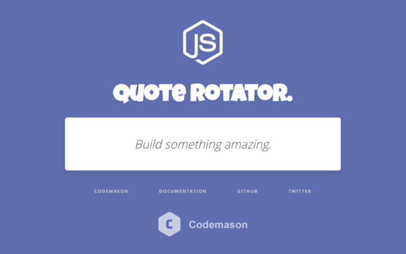

# Getting Started with Node.js on Codemason

This is a simple application that rotates a series of quotes. It accompanies the [Getting Started with Node.js on Codemason](https:/codemason.io/docs/getting-started-with-nodejs) guide.

You can use this to quickly experiment with deploying an application to Codemason.




### Local Development
Run the app locally with docker-compose 
```
docker-compose up -d
```
Your app should now be running on [localhost](http://localhost).

### Deploying to Codemason
```
$ mason create getting-started-nodejs
$ git push codemason master
$ mason services:create getting-started-nodejs/web
```

or 

[](https://codemason.io/apps/create?template=https://github.com/codemasonhq/getting-started-nodejs)